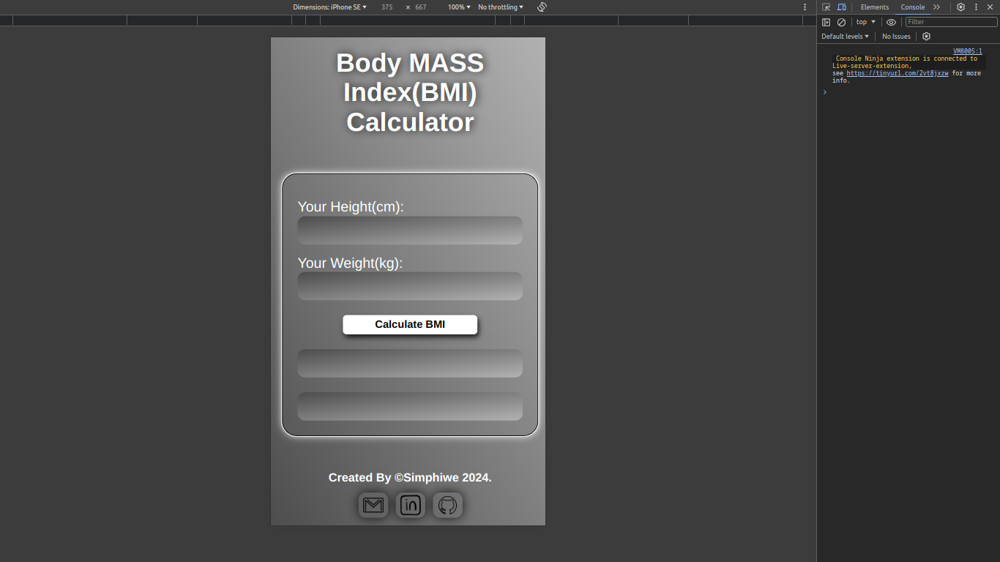
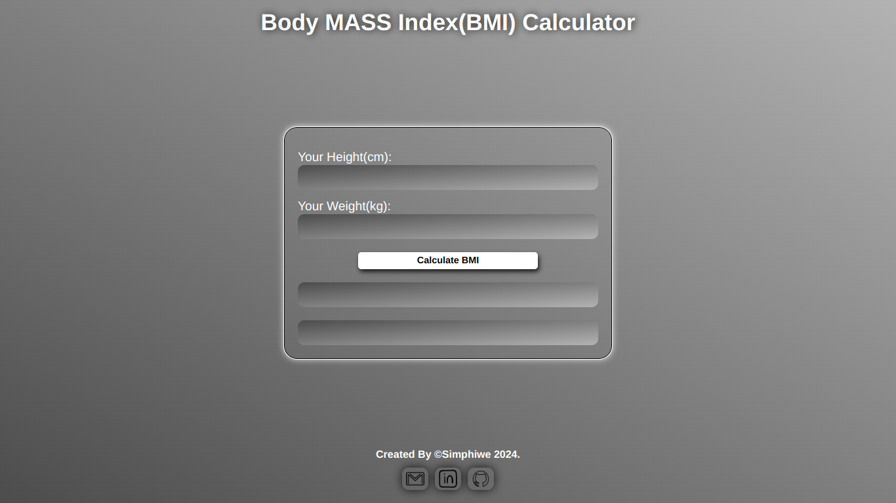

# Body Mass Index(BMI) Calculator

Check it _**LIVE**_ 👉
**<https://deebest.github.io/bmi-calculator/>**

BMI calculator web application built with _HTML_, _CSS_ and JavaScript. Punch in your height and weight and the app will calculate your BMI.

## Uses

- Your can use the app to keep track of your health and adjust where you're lacking.

## Tech Stack Used

- GIT
- HTML
- CSS
- JavaScript

## Get In Touch 👇

Email : **<simphiwedladla8@gmail.com>**

Linked: **<https://www.linkedin.com/in/dladla-simphiwe-89061a20a/>**

Github: **<https://github.com/DeeBest>**

Portfolio: **<https://deebest.github.io/personal-webpage/>**
